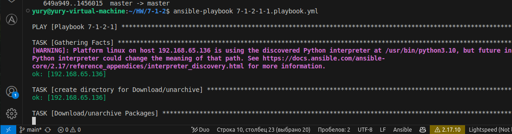

# Домашнее задание к занятию «Ansible- часть 2» Шелухин Юрий

### Задание 1

**Что нужно сделать:**

Выполните действия, приложите файлы с плейбуками и вывод вы полнения. Напишите три плейбука. При написании рекомендуем использовать текстовый редактор с подсветкой синтаксиса YAML.  

Плейбуки должны:  

1. Скачать какой-либо архив, создать папку для распаковки и распаковать скаченный архив. Например, можете использовать официальный сайт и зеркало Apache Kafka. При этом можно скачать как исходный код, так и бинарные файлы, запакованные в архив — в нашем задании не принципиально.  
2. Установить пакет tuned из стандартного репозитория вашей ОС. Запустить его, как демон — конфигурационный файл systemd появится автоматически при установке. Добавить tuned в автозагрузку. 
3. Изменить приветствие системы (motd) при входе на любое другое. Пожалуйста, в этом задании используйте переменную для задания приветствия. Переменную можно задавать любым удобным способом.  

---  

## Решение 1

1. 
Установим ansible (с таким способм формируется config file = /etc/ansible/ansible.cfg)  
sudo apt update  
sudo apt install software-properties-common  
sudo apt-add-repository --yes --update ppa:ansible/ansible  
sudo apt install ansible  
Наполним конфигурационный файл Ansible (ansible.cfg), в котором перечислены все настройки по умолчанию следующим образом:  
:~/HW/7-1-2$ ansible-config init --disabled > ansible.cfg  
отключим проверку ключей при подключении по SSH 
host_key_checking=false  
скопируем файл hosts в директорию с домашним заданием 
  
настроим переменную
export PATH=$PATH:/usr/bin/ansible  
Настроим второй компьютер (воркер, 192.168.65.136)  
sudo apt install openssh-server openssh-client  
отправим на него публичный ключ    
ssh-copy-id yury@192.168.65.136  
проверим  
ansible my -m ping -i hosts  
    
Вновь исправим конфигурационный файл, чтобы не указывать при запуске ansible файл hosts, проверим  
inventory = /home/yury/HW/7-1-2/hosts  
   
Проверим синтаксиса плейбука:  
ansible-playbook 7-1-2-1-1.playbook.yml --syntax-check (+)    
Запустим плейбук:    
ansible-playbook 7-1-2-1-1.playbook.yml   
     
проверим на воркере    
   
[ссылка на плейбук](./7-1-2-1-1.playbook.yml).  

2. 
Создадим плейбук, используя модули apt, ansible.builtin.service, ansible.builtin.systemd и метод повышения прав.  
Исправим конфигурационный файл  
  
запустим плейбук (подходит такой ключ)  
ansible-playbook 7-1-2-1-2.playbook.yml --ask-become-pass    
все модули  отработали  
  
проверим добавдение демона в автозагрузку  
systemctl list-unit-files --type=service --state=enabled | grep tuned  
  
[ссылка на плейбук](./7-1-2-1-2.playbook.yml).

3. 
Приветствие до изменения  
  
Создадим плейбук, используя модуль copy, метод повышения прав и указание переменной в отдельном файле.  
Запустим плейбук.  
ansible-playbook 7-1-2-1-3.playbook.yml --ask-become-pass  
модуль отработал  
  
Зайдем для проверки на управляемый хост через SSH.
  
[ссылка на плейбук](./7-1-2-1-3.playbook.yml).  
[ссылка на файл со значением переменной](./vars/motd.yml).  

---

### Задание 2

Выполните действия, приложите файлы с модифицированным плейбуком и вывод выполнения.

Модифицируйте плейбук из пункта 3, задания 1. В качестве приветствия он должен установить IP-адрес и hostname управляемого хоста, пожелание хорошего дня системному администратору.  

## Решение 2

 

---

## Задание 3

Выполните действия, приложите архив с ролью и вывод выполнения.
Ознакомьтесь со статьёй «Ansible - это вам не bash», сделайте соответствующие выводы и не используйте модули shell или command при выполнении задания.

Создайте плейбук, который будет включать в себя одну, созданную вами роль. Роль должна:

1. Установить веб-сервер Apache на управляемые хосты.  
2. Сконфигурировать файл index.html c выводом характеристик каждого компьютера как веб-страницу по умолчанию для Apache. Необходимо включить CPU, RAM, величину первого HDD, IP-адрес. Используйте Ansible facts и jinja2-template. Необходимо реализовать handler: перезапуск Apache только в случае изменения файла конфигурации Apache.  
3. Открыть порт 80, если необходимо, запустить сервер и добавить его в автозагрузку.  
4. Сделать проверку доступности веб-сайта (ответ 200, модуль uri).  

В качестве решения:

-предоставьте плейбук, использующий роль;  
-разместите архив созданной роли у себя на Google диске и приложите ссылку на роль в своём решении;  
-предоставьте скриншоты выполнения плейбука;  
-предоставьте скриншот браузера, отображающего сконфигурированный index.html в качестве сайта.  

## Решение 3

1. 
    

2. 
   

3. 
  

4. 

---
